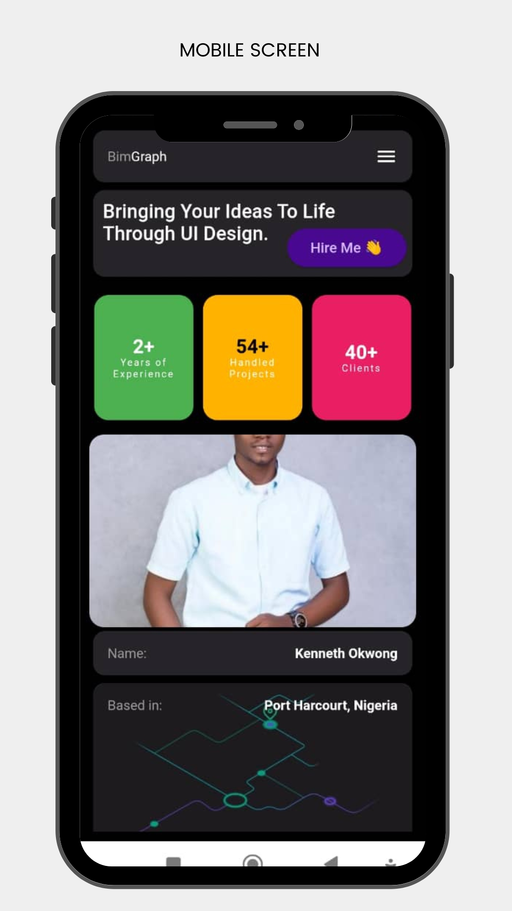
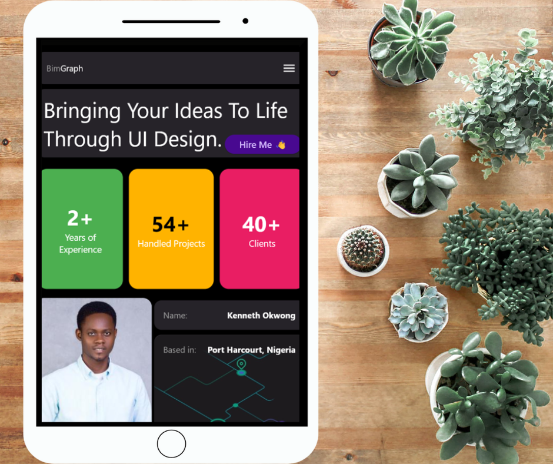
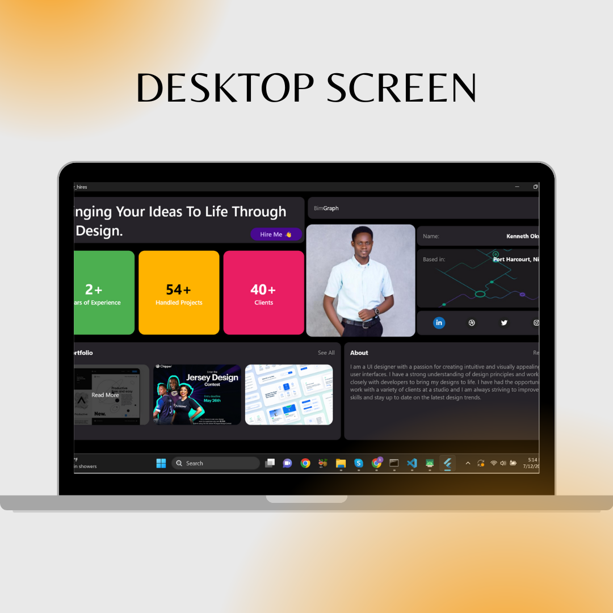

# Meals App

Designer hires, a responsive flutter application.

## Description
The app is a one-page flutter application built to sharpen the knowledge of building responsive apps.
It adapts to changes in screen sizes.

## Flutter concepts demonstrated in the project
1. Responsive design
2. Working with JSON input
3. App theming
4. App theming
5. Custom Widgets

## Getting Started
The first step to testing or running this app is getting the code

    git clone https://github.com/kennethOkwong/Designer-hires.git
    .
    .
    flutter pub get

Run the app to confirm that everything works
    
    flutter run

## App Features
Major app screens are shown below:

### Mobile Screen

### Tablet Screen

### Desktop Screen

